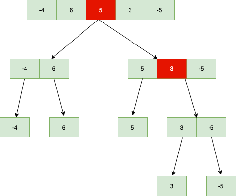
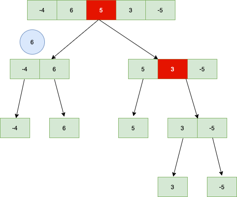
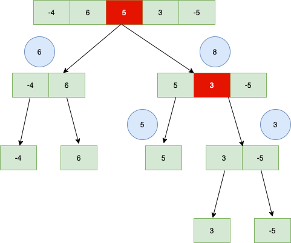

# Divide and Conquer (分治法)

## 目錄

- [Divide and Conquer (分治法)](#divide-and-conquer-分治法)
  - [目錄](#目錄)
  - [原理](#原理)
  - [解題思路](#解題思路)
    - [解釋](#解釋)
      - [1. 分割](#1-分割)
      - [2. 解決 & 合併](#2-解決--合併)
    - [範例程式碼](#範例程式碼)

## 原理

Divide and Conquer 的精神是將一個較為複雜的問題切割成數個容易解決的小問題，而原複雜問題的答案即是這些小問題答案之合併。

一般來說，Divide and Conquer 方法共分為三大步驟：

1. Divide (分解)：將原問題分解為若干個規模較小，相對獨立，與原問題形式相同的子問題。
2. Conquer (解決)：若子問題規模較小且易於解決時，則直接解。否則，遞迴地解決各子問題。
3. Combine (合併)：將各子問題的解合併為原問題的解。

## 解題思路

### 解釋

這邊為了解釋方便的緣故，我們以 `nums = [-4, 6, 5, 3, -5]` 為例，其他題目可以同樣的邏輯進行推論。

本題一共包含：

1. 分割
2. 解決 & 合併

#### 1. 分割

首先，我們要先從中間分切 `nums`，如 `nums`的長度為奇數，則中間的內容 (圖一中以紅色標示) 我們分割至右邊的串列 (list) 中。 分割完成後應如下圖：



#### 2. 解決 & 合併

**這部分為本題的關鍵**。在本題中，可能會出現的答案不只有 "左邊串列最大值" 和 "右邊串列最大值"，最大值也有可能是跨左右的，故我們也須考慮進去 "中間串列最大值" 的情況，而中間串列最大值，很簡單，就是從中間出發，分別考慮左邊最大和右邊最大，最後將左右相加即為中間最大值。

我們先從左下角 [-4, 6] 開始解決。

左邊串列最大值為 `-4` (畢竟只有它一個XD)，而右邊串列最大值為 `6`，
中間的話則是將左邊最大 (-4) 和右邊最大 (6) 相加為2

故在 [-4, 6] 情況之最大值為 ```max(-4, 6, 2) = 6```



接著考慮右下角部分。

5的部分，很簡單，就是5。

[3, -5] 的部分，一樣的邏輯，```max(3, -5, -2) = 3```

我們接著將 `5` 和 `[3, -5]` 兩塊合併，左邊串列最大值為 `5`，右邊串列最大值為 `3`，而中間串列則是將左最大 (```5```) 加上右最大 (```max(3, 3-5) = 3```)，故中間串列最大值為 `5 + 3 = 8`

故在 [5, 3, -5] 情況之最大值為 ```max(5, 3, 8) = 8```



最後就是原本題目 `[-4, 6, 5, 3, -5]` 的部分。

從前面我們已經得知左邊串列最大值為 `6` ，右邊串列最大值為 `8` ，而中間串列則是將左最大 (```max(6, 6-4) = 6```) 加上右最大 (```max(5, 5+3, 5+3-5) = 8```)，故中間串列最大值為 ```6 + 8 = 14```

至此，題目已經成功解開，```max(6, 8, 14) = 14```。

### 範例程式碼

```python
class Solution:
    def maxSubArray(self, nums: List[int]) -> int:
        # Base case
        if len(nums) == 1:
            return nums[0]
        else:
            mid = len(nums) // 2
            left_sum = self.maxSubArray(nums=nums[:mid])
            right_sum = self.maxSubArray(nums=nums[mid:])
            cross_sum = self.max_crossing_subarray(nums=nums, mid=mid)
            return max(left_sum, right_sum, cross_sum)

    def max_crossing_subarray(self, nums: List[int], mid: int) -> float:
        # Left side
        left_sum = -float("inf")
        current_sum = 0
        for i in nums[mid - 1 :: -1]:
            current_sum += i
            left_sum = max(current_sum, left_sum)

        # Right side
        right_sum = -float("inf")
        current_sum = 0
        for j in nums[mid::]:
            current_sum += j
            right_sum = max(current_sum, right_sum)

        # Return left + right
        return left_sum + right_sum
```
